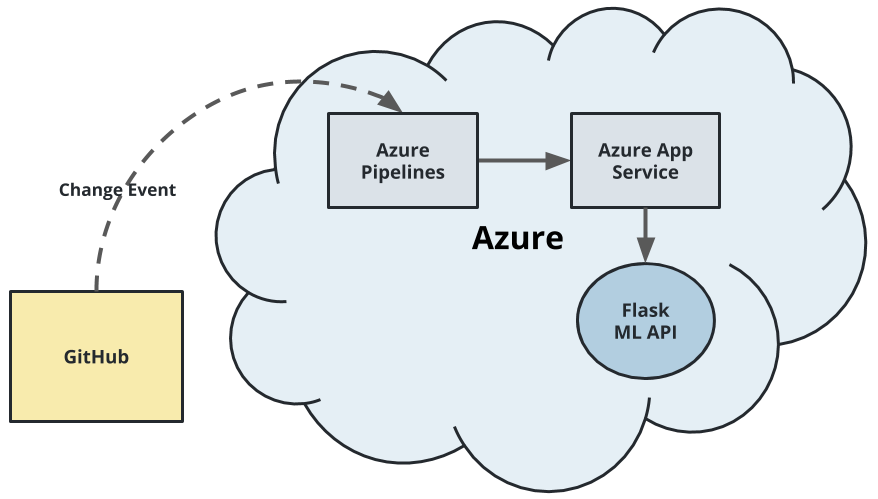
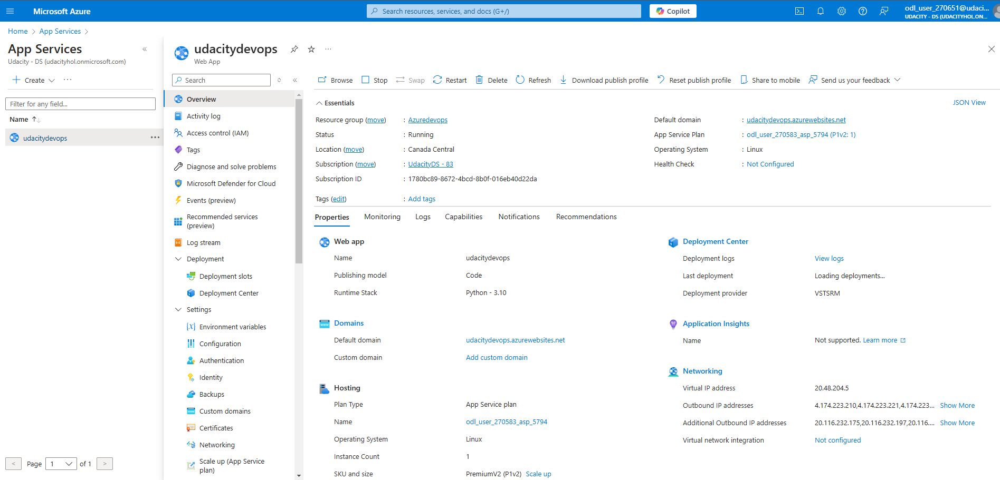
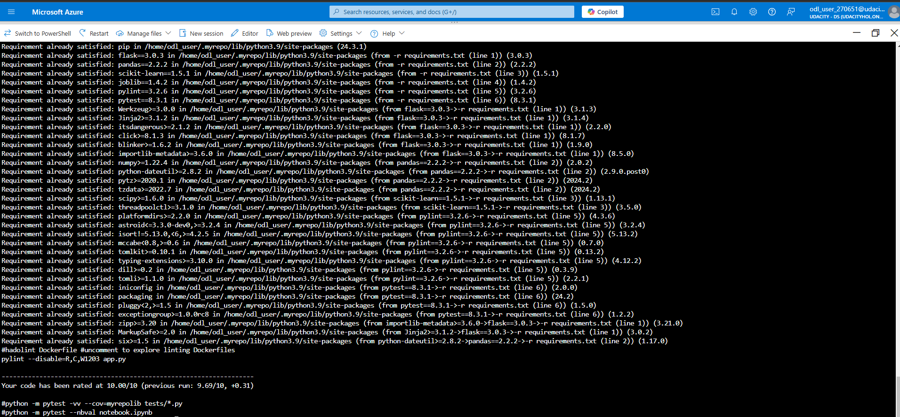
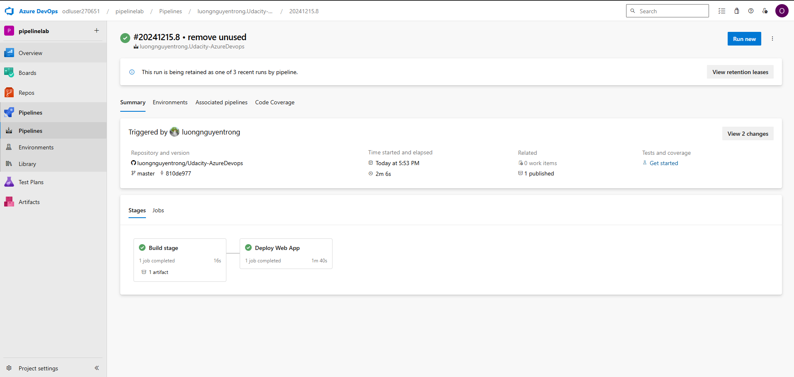
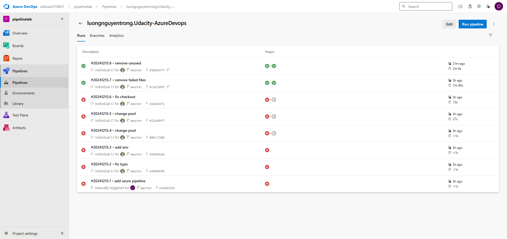
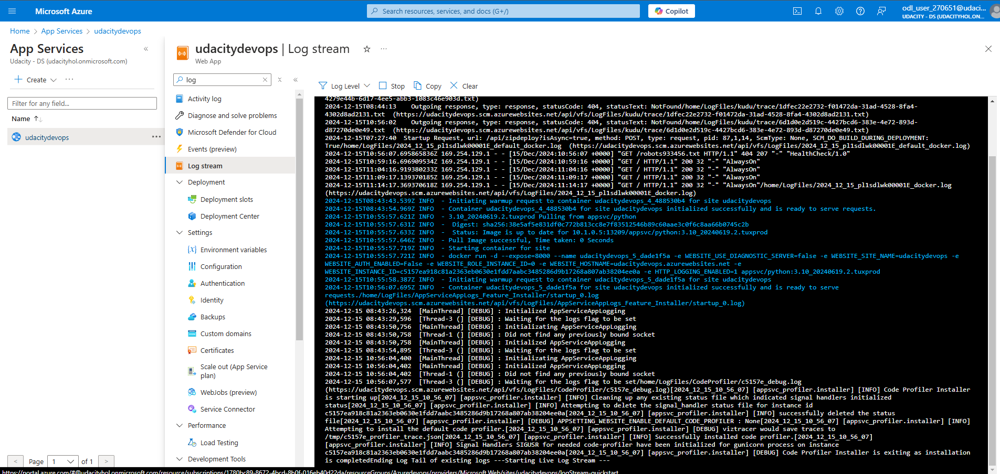

# Overview


In this project, you will build a Github repository from scratch and create a scaffolding that will assist you in performing both Continuous Integration and Continuous Delivery. You'll use Github Actions along with a `Makefile`, `requirements.txt` and application code to perform an initial lint, test, and install cycle. Next, you'll integrate this project with Azure Pipelines to enable Continuous Delivery to Azure App Service.

## Project Plan
This submission is part of the 'Building a CI/CD Pipeline' project, a requirement for Udacity's 'DevOps Engineer for Microsoft Azure' Nanodegree program.

The project includes a Python application for predicting housing prices in Boston; however, the application itself was not developed by me.

Key Features of This Repository:
Deployment of the application in Azure CloudShell.
Deployment of the application as an Azure App Service.
Automated code testing using GitHub Actions, triggered by any commits to the repository.
Implementation of a CI/CD pipeline in Azure DevOps, enabling automatic testing and deployment of updated code to the Azure App Service.

A [Trello](https://trello.com/b/vxEsbB0y/udacity-azure-devops-building-ci-cd-pipeline) board to monitor task progress.

Additionally, a [spreadsheet](https://docs.google.com/spreadsheets/d/1HsLqrNCmm3ldwu1NFBVSADi5dgP4i5Ed2bWTacX1AlA/edit?usp=sharing) has been set up to oversee the project schedule.

For a visual demonstration of the project, please refer to this [YouTube video]().

## Instructions



* Create an Azure App service for this project



* Project cloned into Azure Cloud Shell

```shell
git clone https://github.com/luongnguyentrong/Udacity-AzureDevops.git
```

* Passing tests that are displayed after running the `make all` command from the `Makefile`

```shell
make all
```

* Output of a test run


* Successful deploy of the project in Azure Pipelines.  [Note the official documentation should be referred to and double checked as you setup CI/CD](https://docs.microsoft.com/en-us/azure/devops/pipelines/ecosystems/python-webapp?view=azure-devops).


* Running Azure App Service from Azure Pipelines automatic deployment


* Successful prediction from deployed flask app in Azure Cloud Shell.  [Use this file as a template for the deployed prediction](https://github.com/udacity/nd082-Azure-Cloud-DevOps-Starter-Code/blob/master/C2-AgileDevelopmentwithAzure/project/starter_files/flask-sklearn/make_predict_azure_app.sh).
The output should look similar to this:

```bash
udacity@Azure:~$ ./make_predict_azure_app.sh
Port: 443
{"prediction":[20.35373177134412]}
```

* Output of streamed log files from deployed application


## Enhancements

To further improve the "Building a CI/CD Pipeline" project, consider these key suggestions:

* **Enhanced Documentation**: Improve project documentation and include detailed comments in the codebase.
* **Comprehensive Unit** Testing: Increase test coverage, focusing on the machine learning model and API functionality.
* **Code Review** Practices: Establish a formal code review process to ensure code quality.
* **Improved Security**: Strengthen security measures, such as implementing robust input validation.
* **Containerization:** Package the application using Docker for consistent deployment.
* **Container Orchestration**: Introduce container orchestration tools like Kubernetes for scalability and reliability.
* **Performance Monitoring**: Regularly monitor and optimize the application's performance.
* **CI/**CD Pipeline Enhancements: Streamline the CI/CD pipeline to improve efficiency and reduce build times.
* **Scaling Strategy**: Develop a strategy for application scaling and dynamic resource management.
* **Backup and** Recovery: Establish a solid backup and disaster recovery plan to protect against data loss.

## Demo 

<TODO: Add link Screencast on YouTube>


